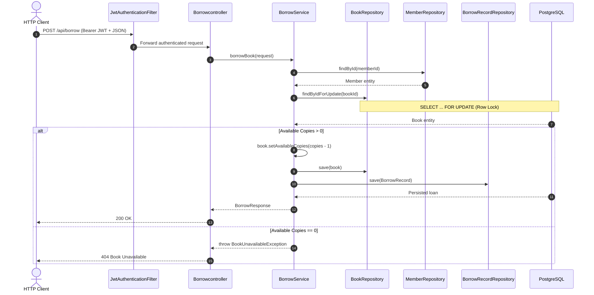
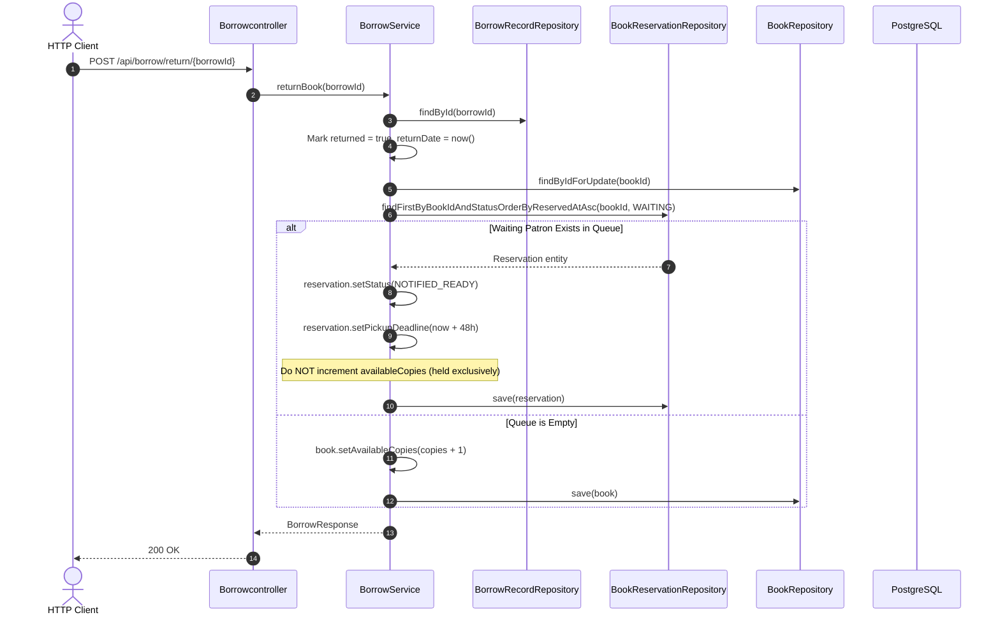

# 🏛️ Architecture & System Design -- LibroSphere

This document details the architectural principles, layer responsibilities, design patterns, security design, and request/response workflows of the **Library Management System (LibroSphere)**.

---

## 🧭 Architectural Philosophy: Clean Layered Backend

The application is structured strictly around **Clean Layered Architecture**. Each layer has distinct, non-overlapping responsibilities. Flow of control moves downward from Controllers through Services to Repositories, while data returns upward encapsulated in Data Transfer Objects (DTOs).

```
+-------------------------------------------------------------------------------+
|                               HTTP CLIENT                                     |
|             (Postman, Web Frontend, Mobile Client, cURL, Swagger)            |
+---------------------------------------+---------------------------------------+
                                        |
                                        | JSON Payloads / JWT Bearer Tokens
                                        v
+-------------------------------------------------------------------------------+
|                           SPRING SECURITY LAYER                               |
|   SecurityConfig | JwtAuthenticationFilter | CustomUserDetailsService         |
|   - Stateless JWT Verification & Claims Validation                            |
|   - Role-Based Access Control (RBAC: ADMIN, LIBRARIAN, ASSISTANT)             |
|   - Standardized 401 Unauthorized / 403 Forbidden Handlers                    |
+---------------------------------------+---------------------------------------+
                                        |
                                        | Authenticated Request
                                        v
+-------------------------------------------------------------------------------+
|                             CONTROLLER LAYER                                  |
|   AuthController | BookController | MemberController | Borrowcontroller       |
|   ReservationController | FineController                                      |
|   - Exposes RESTful HTTP endpoints (GET, POST, PUT, DELETE)                   |
|   - Enforces Request Body Validation (@Valid, @NotBlank, @NotNull)            |
|   - Returns standardized ResponseEntity<DTO> objects                          |
+---------------------------------------+---------------------------------------+
                                        |
                                        | Validated Inbound DTOs
                                        v
+-------------------------------------------------------------------------------+
|                               SERVICE LAYER                                   |
|   AuthService | BookService | MemberService | BorrowService | JwtService      |
|   ReservationService | FineService | RefreshTokenService                      |
|   - Encapsulates Core Business Logic & State Rules                            |
|   - Transaction Management (@Transactional) & Row Locking                     |
|   - Maps Entities <-> DTOs (DTO Isolation)                                    |
|   - Throws Custom Domain Exceptions                                           |
+---------------------------------------+---------------------------------------+
                                        |
                                        | Domain Entities
                                        v
+-------------------------------------------------------------------------------+
|                             REPOSITORY LAYER                                  |
|   UserRepository | BookRepository | MemberRepository | BorrowRecordRepository |
|   BookReservationRepository | FineRecordRepository | RefreshTokenRepository   |
|   - Spring Data JPA Interfaces extending JpaRepository<T, ID>                 |
|   - Pessimistic Row Locking (@Lock(LockModeType.PESSIMISTIC_WRITE))           |
|   - High-performance composite B-Tree indexed queries                         |
+---------------------------------------+---------------------------------------+
                                        |
                                        | SQL / JDBC
                                        v
+-------------------------------------------------------------------------------+
|                         POSTGRESQL RELATIONAL DB                              |
|   users | refresh_tokens | books | members | borrow_records                   |
|   book_reservations | fine_records                                            |
+-------------------------------------------------------------------------------+
```

### Background Asynchronous Scheduling
```
+-------------------------------------------------------------------------------+
|                       BACKGROUND ASYNC WORKER LAYER                           |
|   OverdueReconciliationWorker (@Scheduled cron = "0 0 0 * * *")              |
|   - Nightly automated audit of unreturned overdue loans                       |
|   - Idempotent tiered fine calculation via FineService                        |
+-------------------------------------------------------------------------------+
```

---

## 🧱 Deep Dive into Architectural Layers

### 1. Controller Layer (`com.nikunj.library.controller`)
- **Responsibility**: Handles HTTP ingress and egress, URI routing, request deserialization, payload validation, and HTTP status code dispatching.
- **Controllers**:
  - `AuthController`: Handles `/auth/login`, `/auth/register`, `/auth/refresh`, and `/auth/logout`.
  - `BookController`: Handles book CRUD operations and indexed search (`/api/books/search`).
  - `MemberController`: Handles member lifecycle management (`/api/members`).
  - `Borrowcontroller`: Orchestrates book checkouts and return processing (`/api/borrow`).
  - `ReservationController`: Manages the FIFO waitlist queue and cancellations (`/api/reservations`).
  - `FineController`: Handles library-wide ledger audits, patron liability lookups, and payment settlements (`/api/fines`).
- **Rules**:
  - Never interact directly with repositories or entities.
  - Return DTOs exclusively.
  - Annotate inbound DTOs with `@Valid` to trigger automatic Jakarta Bean Validation.

### 2. Service Layer (`com.nikunj.library.service`)
- **Responsibility**: Contains all domain business logic, transactional orchestrations, concurrency locks, and data mappings.
- **Rules**:
  - Enforce business invariants (e.g., verifying `availableCopies > 0` before checkout, or checking for active reservations).
  - Annotate state mutations with `@Transactional` to guarantee ACID atomicity.
  - Use Pessimistic Locking (`findByIdForUpdate`) for inventory modifications to prevent double-checkouts under high concurrency.
  - Never leak JPA entities directly to the Controller layer; translate entities to response DTOs.
  - Throw domain-specific runtime exceptions on rule violations (`BookUnavailableException`, `DuplicateReservationException`).

### 3. Repository Layer (`com.nikunj.library.repository`)
- **Responsibility**: Data access abstraction using Spring Data JPA.
- **Repositories**:
  - `BookRepository`: Includes `@Lock(LockModeType.PESSIMISTIC_WRITE)` query `findByIdForUpdate(Long id)`.
  - `BookReservationRepository`: Includes FIFO ordering queries `findFirstByBookIdAndStatusOrderByReservedAtAsc`.
  - `BorrowRecordRepository`: Includes composite query `findByReturnedFalseAndDueDateBefore` for overdue tracking.
  - `FineRecordRepository`: Includes idempotent query lookups by loan and member.
  - `MemberRepository`, `UserRepository`, `RefreshTokenRepository`.

### 4. Entity / Model Layer (`com.nikunj.library.model`)
- **Responsibility**: Represents relational database tables in Java object form.
- **Entities**:
  - `Book`: Multi-copy inventory (`totalCopies`, `availableCopies`, `title`, `author`).
  - `Member`: Library patrons (`name`, `email`, `phoneNumber`).
  - `BorrowRecord`: Relational records linking Book and Member (`borrowDate`, `dueDate`, `returnDate`, `returned`).
  - `BookReservation`: FIFO waitlist queue items (`status`, `reservedAt`, `pickupDeadline`).
  - `FineRecord`: Accrued overdue liabilities (`amount`, `paid`, `calculatedAt`, `paidAt`).
  - `User`: System staff credentials with hashed passwords and assigned roles.
  - `RefreshToken`: Cryptographic refresh tokens tied to users for session renewal.

### 5. Worker Layer (`com.nikunj.library.worker`)
- **Responsibility**: Background tasks running decoupled from HTTP request threads.
- **Worker**: `OverdueReconciliationWorker` runs every midnight (`0 0 0 * * *`) via Spring `@Scheduled`, identifying all active loans past their due date and deterministically calculating tiered fines via `FineService`.

### 6. DTO Layer (`com.nikunj.library.dto`)
- **Responsibility**: Strict contract definition between the client and the server.
- **Decoupling**: Prevents leaking internal database IDs or passwords, isolates database schema refactoring from public API contracts.

---

## 🔒 Security & Authentication Architecture

```
                       Incoming HTTP Request
                                 │
                                 ▼
                     [ JwtAuthenticationFilter ]
                                 │
                   Has 'Authorization: Bearer ...'?
                     ┌───────────┴───────────┐
                    YES                      NO
                     │                       │
           Validate HMAC-SHA256              ▼
         Signature & Expiration     Is Endpoint Public?
                     │                (/auth/login, /auth/refresh,
             Valid?  │                /v3/api-docs/**, /swagger-ui/**)
          ┌──────────┴──────────┐     ┌──────┴──────┐
         YES                    NO   YES            NO
          │                     │     │             │
  Load UserDetails &            │     │             ▼
  Set SecurityContext           │     │       401 Unauthorized
          │                     │     │     (AuthenticationEntryPoint)
          └──────────┬──────────┘     │
                     │                │
                     ▼                ▼
           [ Role Authorization Check ]
             (hasRole / hasAnyRole)
                     │
             Authorized?
          ┌──────────┴──────────┐
         YES                    NO
          │                     │
          ▼                     ▼
  Proceed to Controller    403 Forbidden
                       (AccessDeniedHandler)
```

1. **Stateless JWT Sessions**:
   - No `HttpSession` is stored on the server (`SessionCreationPolicy.STATELESS`).
   - Every request is authenticated on the fly via the `JwtAuthenticationFilter`.
2. **Refresh Token Rotation**:
   - Login issues both a short-lived access token (JWT) and a persisted refresh token (UUID).
   - Calling `/auth/refresh` verifies the token in PostgreSQL, checks expiration and revocation status, and returns renewed tokens.
   - Calling `/auth/logout` sets `revoked = true`, instantly invalidating the refresh token.
3. **Role Hierarchy & RBAC**:
   - `ADMIN`: Full access (user registration, catalog deletion, manual fine reconciliation).
   - `LIBRARIAN`: Management access (catalog management, member operations, fine overview).
   - `ASSISTANT`: Operational access (catalog search, checkout/returns, patron fine settlements).

---

## ⚠️ Centralized Exception Handling Architecture

Centralized exception handling is implemented via `@ControllerAdvice` in `GlobalExceptionHandler`:

```
               Exception Thrown in Service / Controller
                                 │
                                 ▼
                    [ GlobalExceptionHandler ]
                                 │
       ┌─────────────────────────┼─────────────────────────┐
       ▼                         ▼                         ▼
 [ Domain 404s ]          [ Conflict 409s ]         [ Validation 400s ]
 BookNotFoundException    DuplicateReservation      MethodArgumentNotValid
 MemberNotFoundException  Exception                 Exception
 BorrowRecordNotFound     (Active waitlist          (Field validation
 Exception                conflict)                 errors)
 FineNotFoundException
 ReservationNotFound
 Exception
 BookUnavailableException
```

---

## 🔄 Sequence Workflows

### 1. Concurrency-Safe Borrow Workflow (`POST /api/borrow`)


### 2. Return & FIFO Waitlist Auto-Assignment (`POST /api/borrow/return/{borrowId}`)

