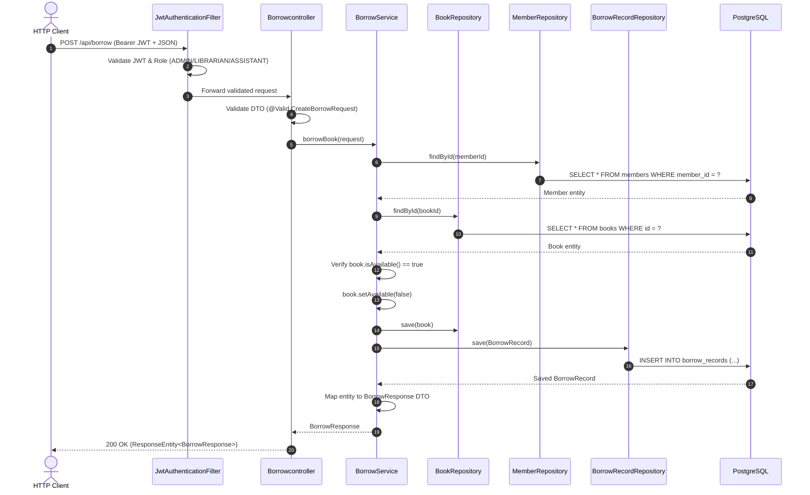

# 🏛️ Architecture & System Design

This document details the architectural principles, layer responsibilities, design patterns, security design, and request/response workflows of the **Library Management System**.

---

## 🧭 Architectural Philosophy: Clean Layered Backend

The application is structured strictly around **Clean Layered Architecture**. Each layer has distinct, non-overlapping responsibilities. Flow of control moves downward from Controllers through Services to Repositories, while data returns upward encapsulated in Data Transfer Objects (DTOs).

```
+-------------------------------------------------------------------------------+
|                               HTTP CLIENT                                     |
|             (Postman, Web Frontend, Mobile Client, cURL)                      |
+---------------------------------------+---------------------------------------+
                                        |
                                        | JSON Payloads / JWT Bearer Tokens
                                        v
+-------------------------------------------------------------------------------+
|                           SPRING SECURITY LAYER                               |
|   SecurityConfig | JwtAuthenticationFilter | CustomUserDetailsService         |
|   - Stateless JWT Verification & Claims Validation                            |
|   - Role-Based Access Control (RBAC: ADMIN, LIBRARIAN, ASSISTANT)             |
|   - Standardized 401 Unauthorized / 403 Forbidden Handlers                    |
+---------------------------------------+---------------------------------------+
                                        |
                                        | Authenticated Request
                                        v
+-------------------------------------------------------------------------------+
|                             CONTROLLER LAYER                                  |
|   AuthController | BookController | MemberController | Borrowcontroller       |
|   - Exposes RESTful HTTP endpoints (GET, POST, PUT, DELETE)                   |
|   - Enforces Request Body Validation (@Valid, @NotBlank, @NotNull)            |
|   - Returns standardized ResponseEntity<DTO> objects                          |
+---------------------------------------+---------------------------------------+
                                        |
                                        | Validated Inbound DTOs
                                        v
+-------------------------------------------------------------------------------+
|                               SERVICE LAYER                                   |
|   AuthService | BookService | MemberService | BorrowService | JwtService      |
|   - Encapsulates Core Business Logic & State Rules                            |
|   - Transaction Management (@Transactional)                                   |
|   - Maps Entities <-> DTOs (DTO Isolation)                                    |
|   - Throws Custom Domain Exceptions                                           |
+---------------------------------------+---------------------------------------+
                                        |
                                        | Domain Entities
                                        v
+-------------------------------------------------------------------------------+
|                             REPOSITORY LAYER                                  |
|   UserRepository | BookRepository | MemberRepository | BorrowRecordRepository |
|   - Spring Data JPA Interfaces extending JpaRepository<T, ID>                 |
|   - Database Query Abstraction & CRUD Operations                              |
+---------------------------------------+---------------------------------------+
                                        |
                                        | SQL / JDBC
                                        v
+-------------------------------------------------------------------------------+
|                         POSTGRESQL RELATIONAL DB                              |
|   users | refresh_tokens | books | members | borrow_records                   |
+-------------------------------------------------------------------------------+
```

---

## 🧱 Deep Dive into Architectural Layers

### 1. Controller Layer (`com.nikunj.library.controller`)
- **Responsibility**: Handles HTTP ingress and egress, URI routing, request deserialization, payload validation, and HTTP status code dispatching.
- **Rules**:
  - Never interact directly with repositories or entities.
  - Wrap all outbound responses inside `ResponseEntity<T>` or direct DTO responses.
  - Annotate inbound DTOs with `@Valid` to trigger automatic Jakarta Bean Validation.

### 2. Service Layer (`com.nikunj.library.service`)
- **Responsibility**: Contains all domain business logic, transactional orchestrations, and data mappings.
- **Rules**:
  - Enforce business invariants (e.g., verifying `book.isAvailable() == true` before borrowing).
  - Annotate multi-step mutations with `@Transactional` to guarantee ACID properties.
  - Never leak JPA entities directly to the Controller layer; always translate entities to response DTOs (`BookResponse`, `MemberResponse`, `BorrowResponse`).
  - Throw domain-specific runtime exceptions on rule violations (`BookUnavailableException`, `MemberNotFoundException`).

### 3. Repository Layer (`com.nikunj.library.repository`)
- **Responsibility**: Data access abstraction using Spring Data JPA.
- **Rules**:
  - Extend `JpaRepository<Entity, Long>`.
  - Provide declarative query methods (`findByUsername`, `findByToken`, `deleteByUser`).
  - Rely on Hibernate ORM for parameterized SQL generation to prevent SQL injection.

### 4. Entity / Model Layer (`com.nikunj.library.model`)
- **Responsibility**: Represents relational database tables in Java object form.
- **Annotations**: `@Entity`, `@Table`, `@Id`, `@GeneratedValue(strategy = IDENTITY)`, `@ManyToOne`, `@JoinColumn`, `@Enumerated(EnumType.STRING)`.
- **Entities**:
  - `Book`: Inventory items with title, author, availability flag.
  - `Member`: Library patrons with name, email, phone number.
  - `BorrowRecord`: Relational records linking Book and Member with borrow, due, and return dates.
  - `User`: System staff credentials with hashed passwords and assigned roles.
  - `RefreshToken`: Cryptographic refresh tokens tied to users for session renewal.

### 5. DTO (Data Transfer Object) Layer (`com.nikunj.library.dto`)
- **Responsibility**: Strict contract definition between the client and the server.
- **Design Decisions**:
  - Complete decoupling from database entities.
  - Inbound DTOs (`CreateBookRequest`, `CreateMemberRequest`, `CreateBorrowRequest`, `RegisterRequest`, `LoginRequest`, `RefreshTokenRequest`) contain validation annotations.
  - Outbound DTOs (`BookResponse`, `MemberResponse`, `BorrowResponse`, `LoginResponse`) contain only client-safe fields.

---

## 🔒 Security & Authentication Architecture

```
                       Incoming HTTP Request
                                 │
                                 ▼
                     [ JwtAuthenticationFilter ]
                                 │
                   Has 'Authorization: Bearer ...'?
                     ┌───────────┴───────────┐
                    YES                      NO
                     │                       │
           Validate HMAC-SHA256              ▼
         Signature & Expiration     Is Endpoint Public?
                     │                (/auth/login,
             Valid?  │                /auth/refresh)
          ┌──────────┴──────────┐     ┌──────┴──────┐
         YES                    NO   YES            NO
          │                     │     │             │
  Load UserDetails &            │     │             ▼
  Set SecurityContext           │     │       401 Unauthorized
          │                     │     │     (AuthenticationEntryPoint)
          └──────────┬──────────┘     │
                     │                │
                     ▼                ▼
           [ Role Authorization Check ]
             (hasRole / hasAnyRole)
                     │
             Authorized?
          ┌──────────┴──────────┐
         YES                    NO
          │                     │
          ▼                     ▼
  Proceed to Controller    403 Forbidden
                       (AccessDeniedHandler)
```

1. **Stateless JWT Sessions**:
   - No `HttpSession` is stored on the server (`SessionCreationPolicy.STATELESS`).
   - Every request is authenticated on the fly via the `JwtAuthenticationFilter`.
2. **Refresh Token Rotation**:
   - Login issues both a short-lived access token (JWT) and a persisted refresh token (UUID).
   - Calling `/auth/refresh` verifies the token in PostgreSQL, checks expiration and revocation status, and returns renewed tokens.
   - Calling `/auth/logout` sets `revoked = true`, instantly invalidating the refresh token.
3. **Role Hierarchy & RBAC**:
   - `ADMIN`: Full access (user registration, book deletion, member deletion, all operations).
   - `LIBRARIAN`: Management access (create/update books and members, process borrow/returns).
   - `ASSISTANT`: Operational access (view catalog, view members, process borrow/returns).

---

## ⚠️ Centralized Exception Handling Architecture

Centralized exception handling is implemented via `@ControllerAdvice` in `GlobalExceptionHandler`:

```
               Exception Thrown in Service / Controller
                                 │
                                 ▼
                    [ GlobalExceptionHandler ]
                                 │
       ┌─────────────────────────┼─────────────────────────┐
       ▼                         ▼                         ▼
 [ Domain 404s ]          [ Validation 400s ]       [ Security 401s ]
 BookNotFoundException    MethodArgumentNotValid    TokenRefreshException
 MemberNotFoundException  Exception                 
 BookUnavailableException (Returns list of field    (Returns error string)
 (Returns clean message)   validation errors)       
```

- **Clean Client Contract**: Prevents leaking internal database details or Java stack traces.
- **Configuration Safeguards**: `server.error.include-stacktrace=never` ensures server errors never expose internal file paths.

---

## 🔄 Complete Request-Response Lifecycle Example

### Borrow Book Workflow (`POST /api/borrow`)

