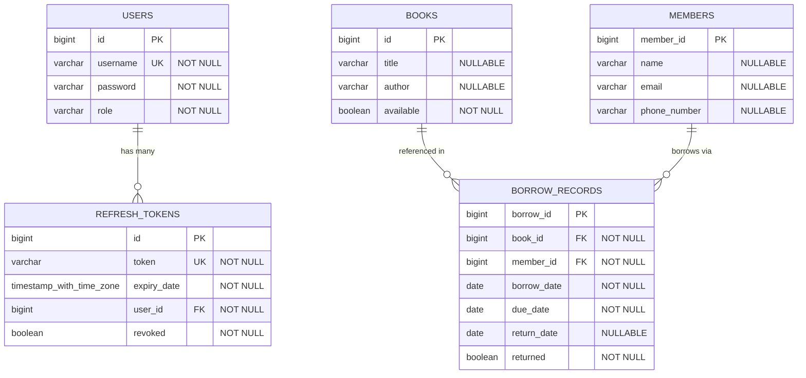

# 🗄️ Database Architecture & Data Models

This document details the database design, entity relationship diagrams (ERD), table structures, column definitions, constraints, relationships, and indexing strategies for the **Library Management System**.

---

## 🛠️ Database Technology Stack

- **RDBMS Engine**: PostgreSQL 16+
- **JPA Provider / ORM**: Hibernate ORM 6.x / Spring Data JPA
- **Database Driver**: `org.postgresql.Driver`
- **Dialect**: `org.hibernate.dialect.PostgreSQLDialect`
- **Schema Strategy**: `spring.jpa.hibernate.ddl-auto=update` (Automated schema synchronization)
- **Transaction Management**: Spring Framework declarative `@Transactional` boundaries

---

## 📊 Entity Relationship Diagram (ERD)

### Mermaid Diagram


---

## 🗃️ Relational Table Specifications

### 1. `users` Table
Stores authentication credentials, user roles, and security details for system operators (Administrators, Librarians, Assistants).

| Column Name | SQL Type | JPA Mapping | Constraints | Description |
|---|---|---|---|---|
| `id` | `BIGINT` | `@Id @GeneratedValue(strategy = IDENTITY)` | `PRIMARY KEY`, Auto-Increment | Unique user identifier |
| `username` | `VARCHAR(255)` | `@Column(nullable = false, unique = true)` | `NOT NULL`, `UNIQUE` | User login username |
| `password` | `VARCHAR(255)` | `@Column(nullable = false)` | `NOT NULL` | BCrypt-hashed password string |
| `role` | `VARCHAR(255)` | `@Enumerated(EnumType.STRING) @Column(nullable = false)` | `NOT NULL` | User role (`ADMIN`, `LIBRARIAN`, `ASSISTANT`) |

#### JPA Entity Reference (`User.java`)
```java
@Entity
@Table(name = "users")
public class User implements UserDetails {
    @Id
    @GeneratedValue(strategy = GenerationType.IDENTITY)
    private Long id;

    @Column(nullable = false, unique = true)
    private String username;

    @Column(nullable = false)
    private String password;

    @Enumerated(EnumType.STRING)
    @Column(nullable = false)
    private Role role;
}
```

---

### 2. `refresh_tokens` Table
Manages persisted refresh tokens for seamless JWT renewal, session management, and revocation tracking.

| Column Name | SQL Type | JPA Mapping | Constraints | Description |
|---|---|---|---|---|
| `id` | `BIGINT` | `@Id @GeneratedValue(strategy = IDENTITY)` | `PRIMARY KEY`, Auto-Increment | Unique record identifier |
| `token` | `VARCHAR(255)` | `@Column(nullable = false, unique = true)` | `NOT NULL`, `UNIQUE` | Cryptographically secure UUID string |
| `expiry_date` | `TIMESTAMP WITH TIME ZONE` | `@Column(nullable = false)` | `NOT NULL` | UTC timestamp of token expiration |
| `user_id` | `BIGINT` | `@ManyToOne @JoinColumn(name = "user_id", nullable = false)` | `FOREIGN KEY -> users(id)` | References the token owner |
| `revoked` | `BOOLEAN` | `private boolean revoked;` | `NOT NULL` | `true` if revoked via logout; else `false` |

#### JPA Entity Reference (`RefreshToken.java`)
```java
@Entity
@Table(name = "refresh_tokens")
public class RefreshToken {
    @Id
    @GeneratedValue(strategy = GenerationType.IDENTITY)
    private Long id;

    @Column(nullable = false, unique = true)
    private String token;

    @Column(nullable = false)
    private Instant expiryDate;

    @ManyToOne
    @JoinColumn(name = "user_id", nullable = false)
    private User user;

    private boolean revoked;
}
```

---

### 3. `books` Table
Maintains the inventory of library books and real-time checkout availability status.

| Column Name | SQL Type | JPA Mapping | Constraints | Description |
|---|---|---|---|---|
| `id` | `BIGINT` | `@Id @GeneratedValue(strategy = IDENTITY)` | `PRIMARY KEY`, Auto-Increment | Unique book identifier |
| `title` | `VARCHAR(255)` | `private String title;` | Nullable | Title of the book |
| `author` | `VARCHAR(255)` | `private String author;` | Nullable | Name of the author |
| `available` | `BOOLEAN` | `private boolean available;` | `NOT NULL` | `true` if in stock, `false` if checked out |

#### JPA Entity Reference (`Book.java`)
```java
@Entity
@Table(name = "books")
public class Book {
    @Id
    @GeneratedValue(strategy = GenerationType.IDENTITY)
    private Long id;
    private String title;
    private String author;
    private boolean available;
}
```

---

### 4. `members` Table
Stores contact information and profile records for registered library members.

| Column Name | SQL Type | JPA Mapping | Constraints | Description |
|---|---|---|---|---|
| `member_id` | `BIGINT` | `@Id @GeneratedValue(strategy = IDENTITY)` | `PRIMARY KEY`, Auto-Increment | Unique member identifier |
| `name` | `VARCHAR(255)` | `private String name;` | Nullable | Full name of the member |
| `email` | `VARCHAR(255)` | `private String email;` | Nullable | Email address |
| `phone_number` | `VARCHAR(255)` | `private String phoneNumber;` | Nullable | Contact telephone number |

#### JPA Entity Reference (`Member.java`)
```java
@Entity
@Table(name = "members")
public class Member {
    @Id
    @GeneratedValue(strategy = GenerationType.IDENTITY)
    private Long memberId;
    private String name;
    private String email;
    private String phoneNumber;
}
```

---

### 5. `borrow_records` Table
Tracks active and historical borrowing transactions between members and books.

| Column Name | SQL Type | JPA Mapping | Constraints | Description |
|---|---|---|---|---|
| `borrow_id` | `BIGINT` | `@Id @GeneratedValue(strategy = IDENTITY)` | `PRIMARY KEY`, Auto-Increment | Unique transaction identifier |
| `book_id` | `BIGINT` | `@ManyToOne @JoinColumn(name = "book_id")` | `FOREIGN KEY -> books(id)` | Foreign key referencing borrowed book |
| `member_id` | `BIGINT` | `@ManyToOne @JoinColumn(name = "member_id")` | `FOREIGN KEY -> members(member_id)` | Foreign key referencing borrower |
| `borrow_date` | `DATE` | `private LocalDate borrowDate;` | `NOT NULL` | Date when checkout occurred |
| `due_date` | `DATE` | `private LocalDate dueDate;` | `NOT NULL` | Date by which book must be returned (+14 days) |
| `return_date` | `DATE` | `private LocalDate returnDate;` | Nullable | Date when book was physically returned |
| `returned` | `BOOLEAN` | `private boolean returned;` | `NOT NULL` | `false` if active, `true` once completed |

#### JPA Entity Reference (`BorrowRecord.java`)
```java
@Entity
@Table(name = "borrow_records")
public class BorrowRecord {
    @Id
    @GeneratedValue(strategy = GenerationType.IDENTITY)
    private Long borrowId;

    @ManyToOne
    @JoinColumn(name = "book_id")
    private Book book;

    @ManyToOne
    @JoinColumn(name = "member_id")
    private Member member;

    private LocalDate borrowDate;
    private LocalDate dueDate;
    private LocalDate returnDate;
    private boolean returned;
}
```

---

## 🔗 Table Relationships Explained

1. **`users` 1 ── N `refresh_tokens`**:
   - A single user can possess multiple refresh tokens across sessions or devices.
   - Associated via `user_id` foreign key.

2. **`books` 1 ── N `borrow_records`**:
   - A book can have multiple historical borrowing records over its lifetime.
   - Associated via `book_id` foreign key.

3. **`members` 1 ── N `borrow_records`**:
   - A member can borrow multiple books across different transactions.
   - Associated via `member_id` foreign key.

---

## ⚡ Indexing & Performance Considerations

- **Primary Keys**: Auto-indexed with B-tree indices in PostgreSQL (`id`, `member_id`, `borrow_id`).
- **Unique Constraints**:
  - `users(username)` is backed by a unique B-tree index for fast $O(\log n)$ user lookups during authentication.
  - `refresh_tokens(token)` is backed by a unique B-tree index for fast token verification and rotation lookups.
- **Foreign Key Columns**: Foreign key columns (`book_id`, `member_id`, `user_id`) benefit from indexing in high-throughput environments to accelerate join queries.
